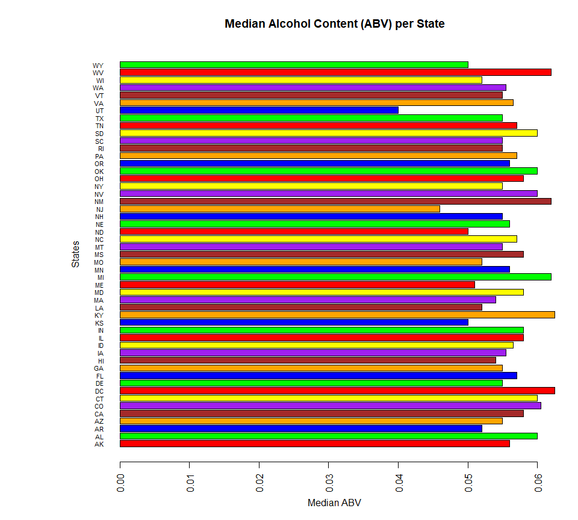

# Breweries

Study of popular Brewed Beers from American domestic and craft varieties; shining a light on what makes them similar and different.  The study analyses the Brews and styles from Lagers, Ales, to the sweet ciders in addition to their bitterness, alcohol content, and where their respective breweries.  From this study we look to find out trends and cultures depending on location and taste, and possibly their appeal to the consumers.

Goal is to analyze collected data, normalize and clean the data, and create analysis that will show an apperent relationship between the bitterness of the bear the alcoholic content. In addition show the bitterness and alcoholic content as per the location it was brewed to determine a trend in culture to that location.

Repository: https://github.com/danageis/SMU-MSDS6306-CaseStudy1

## Analysis 1: Number of Breweries per US State


```r
# Import breweries data and preview data structure.
breweries = read.csv("Raw Data/Breweries.csv", header=TRUE)
str(breweries)
```

```
## 'data.frame':	558 obs. of  4 variables:
##  $ Brew_ID: int  1 2 3 4 5 6 7 8 9 10 ...
##  $ Name   : Factor w/ 551 levels "10 Barrel Brewing Company",..: 355 12 266 319 201 136 227 477 59 491 ...
##  $ City   : Factor w/ 384 levels "Abingdon","Abita Springs",..: 228 200 122 299 300 62 91 48 152 136 ...
##  $ State  : Factor w/ 51 levels " AK"," AL"," AR",..: 24 18 20 5 5 41 6 23 23 23 ...
```

```r
# Entries in 'State' column start with a space.
# Clean data by removing leading white-space and verify new structure.
breweries$State = as.factor(trimws(breweries$State))
str(breweries)
```

```
## 'data.frame':	558 obs. of  4 variables:
##  $ Brew_ID: int  1 2 3 4 5 6 7 8 9 10 ...
##  $ Name   : Factor w/ 551 levels "10 Barrel Brewing Company",..: 355 12 266 319 201 136 227 477 59 491 ...
##  $ City   : Factor w/ 384 levels "Abingdon","Abita Springs",..: 228 200 122 299 300 62 91 48 152 136 ...
##  $ State  : Factor w/ 51 levels "AK","AL","AR",..: 24 18 20 5 5 41 6 23 23 23 ...
```

```r
# Print number of breweries in each state.
# Since each row is a brewery, the number of occurences of each state equals the number of breweries in that state.
breweries.by.state = tapply(breweries$State, breweries$State, length)
print(breweries.by.state)
```

```
## AK AL AR AZ CA CO CT DC DE FL GA HI IA ID IL IN KS KY LA MA MD ME MI MN MO 
##  7  3  2 11 39 47  8  1  2 15  7  4  5  5 18 22  3  4  5 23  7  9 32 12  9 
## MS MT NC ND NE NH NJ NM NV NY OH OK OR PA RI SC SD TN TX UT VA VT WA WI WV 
##  2  9 19  1  5  3  3  4  2 16 15  6 29 25  5  4  1  3 28  4 16 10 23 20  1 
## WY 
##  4
```

## Analysis 2: Merge of Beer & Breweries Data


```r
# Import beer data and preview data structure.
beers = read.csv("Raw Data/Beers.csv", header=TRUE)
str(beers)
```

```
## 'data.frame':	2410 obs. of  7 variables:
##  $ Name      : Factor w/ 2305 levels "#001 Golden Amber Lager",..: 1638 577 1705 1842 1819 268 1160 758 1093 486 ...
##  $ Beer_ID   : int  1436 2265 2264 2263 2262 2261 2260 2259 2258 2131 ...
##  $ ABV       : num  0.05 0.066 0.071 0.09 0.075 0.077 0.045 0.065 0.055 0.086 ...
##  $ IBU       : int  NA NA NA NA NA NA NA NA NA NA ...
##  $ Brewery_id: int  409 178 178 178 178 178 178 178 178 178 ...
##  $ Style     : Factor w/ 100 levels "","Abbey Single Ale",..: 19 18 16 12 16 80 18 22 18 12 ...
##  $ Ounces    : num  12 12 12 12 12 12 12 12 12 12 ...
```

```r
# Change Brewery ID column name for beer data to match brewery data.
names(beers)[5] = "Brew_ID"

# Merge beer and brewery data by 'Brew_ID' and preview naming structure.
brew.data = merge(breweries, beers, by="Brew_ID", all=TRUE)
names(brew.data)
```

```
##  [1] "Brew_ID" "Name.x"  "City"    "State"   "Name.y"  "Beer_ID" "ABV"    
##  [8] "IBU"     "Style"   "Ounces"
```

```r
# Rename variables to be meaningful and verify new structure.
names(brew.data) = replace(names(brew.data), c(2, 5), c('Brew_Name', 'Beer_Name'))
str(brew.data)
```

```
## 'data.frame':	2410 obs. of  10 variables:
##  $ Brew_ID  : int  1 1 1 1 1 1 2 2 2 2 ...
##  $ Brew_Name: Factor w/ 551 levels "10 Barrel Brewing Company",..: 355 355 355 355 355 355 12 12 12 12 ...
##  $ City     : Factor w/ 384 levels "Abingdon","Abita Springs",..: 228 228 228 228 228 228 200 200 200 200 ...
##  $ State    : Factor w/ 51 levels "AK","AL","AR",..: 24 24 24 24 24 24 18 18 18 18 ...
##  $ Beer_Name: Factor w/ 2305 levels "#001 Golden Amber Lager",..: 1640 1926 1525 802 1258 2185 71 458 1218 43 ...
##  $ Beer_ID  : int  2689 2688 2687 2692 2691 2690 2683 2686 2685 2684 ...
##  $ ABV      : num  0.06 0.06 0.056 0.045 0.049 0.048 0.042 0.08 0.125 0.077 ...
##  $ IBU      : int  38 25 47 50 26 19 42 68 80 25 ...
##  $ Style    : Factor w/ 100 levels "","Abbey Single Ale",..: 83 22 57 16 77 48 18 12 46 77 ...
##  $ Ounces   : num  16 16 16 16 16 16 16 16 16 16 ...
```

```r
# Print first 6 and last 6 observations of the merged data for verification.
head(brew.data, 6)
```

```
##   Brew_ID          Brew_Name        City State     Beer_Name Beer_ID   ABV
## 1       1 NorthGate Brewing  Minneapolis    MN       Pumpion    2689 0.060
## 2       1 NorthGate Brewing  Minneapolis    MN    Stronghold    2688 0.060
## 3       1 NorthGate Brewing  Minneapolis    MN   Parapet ESB    2687 0.056
## 4       1 NorthGate Brewing  Minneapolis    MN  Get Together    2692 0.045
## 5       1 NorthGate Brewing  Minneapolis    MN Maggie's Leap    2691 0.049
## 6       1 NorthGate Brewing  Minneapolis    MN    Wall's End    2690 0.048
##   IBU                               Style Ounces
## 1  38                         Pumpkin Ale     16
## 2  25                     American Porter     16
## 3  47 Extra Special / Strong Bitter (ESB)     16
## 4  50                        American IPA     16
## 5  26                  Milk / Sweet Stout     16
## 6  19                   English Brown Ale     16
```

```r
tail(brew.data, 6)
```

```
##      Brew_ID                     Brew_Name          City State
## 2405     556         Ukiah Brewing Company         Ukiah    CA
## 2406     557       Butternuts Beer and Ale Garrattsville    NY
## 2407     557       Butternuts Beer and Ale Garrattsville    NY
## 2408     557       Butternuts Beer and Ale Garrattsville    NY
## 2409     557       Butternuts Beer and Ale Garrattsville    NY
## 2410     558 Sleeping Lady Brewing Company     Anchorage    AK
##                      Beer_Name Beer_ID   ABV IBU                   Style
## 2405             Pilsner Ukiah      98 0.055  NA         German Pilsener
## 2406         Porkslap Pale Ale      49 0.043  NA American Pale Ale (APA)
## 2407           Snapperhead IPA      51 0.068  NA            American IPA
## 2408         Moo Thunder Stout      50 0.049  NA      Milk / Sweet Stout
## 2409  Heinnieweisse Weissebier      52 0.049  NA              Hefeweizen
## 2410 Urban Wilderness Pale Ale      30 0.049  NA        English Pale Ale
##      Ounces
## 2405     12
## 2406     12
## 2407     12
## 2408     12
## 2409     12
## 2410     12
```

## Analysis 3: Missing Data (NA's in each column)


```r
# Create Vector Dataframe which indicates the missing data (NA's)  in each columns as TRUE or FALSE.
brew.data.missing = is.na(brew.data)

# Null out vector to be used in for loop
number_NAs = NULL

# Though not intened, creates vector of "Named ints" where the name of the row associated with each int value
for (i in colnames(brew.data.missing))
{
  tempvec = brew.data.missing[,i]
  number_NAs[i] = length(tempvec[tempvec != FALSE])
}

print(number_NAs)
```

```
##   Brew_ID Brew_Name      City     State Beer_Name   Beer_ID       ABV 
##         0         0         0         0         0         0        62 
##       IBU     Style    Ounces 
##      1005         0         0
```

## Analysis 4: Compute median alcohol content (ABV) and international bitterness unit (IBU) per each state.


```r
# Use "tapply" to find the the median IBU per state
ABV_medians = tapply(brew.data$ABV   # Take the IBU column (numeric)
                     , brew.data$State # Use the State column as the index (as factor) to associate IBU per State
                     , function (x) {median(x, na.rm = TRUE)} #Run created function finding the median per State removing NULLs
)

#Print out the results
cat("The Median Alcohol Content (ABV) per state:\n") #using cat to preserve the \n
```

```
## The Median Alcohol Content (ABV) per state:
```

```r
print(ABV_medians)
```

```
##     AK     AL     AR     AZ     CA     CO     CT     DC     DE     FL 
## 0.0560 0.0600 0.0520 0.0550 0.0580 0.0605 0.0600 0.0625 0.0550 0.0570 
##     GA     HI     IA     ID     IL     IN     KS     KY     LA     MA 
## 0.0550 0.0540 0.0555 0.0565 0.0580 0.0580 0.0500 0.0625 0.0520 0.0540 
##     MD     ME     MI     MN     MO     MS     MT     NC     ND     NE 
## 0.0580 0.0510 0.0620 0.0560 0.0520 0.0580 0.0550 0.0570 0.0500 0.0560 
##     NH     NJ     NM     NV     NY     OH     OK     OR     PA     RI 
## 0.0550 0.0460 0.0620 0.0600 0.0550 0.0580 0.0600 0.0560 0.0570 0.0550 
##     SC     SD     TN     TX     UT     VA     VT     WA     WI     WV 
## 0.0550 0.0600 0.0570 0.0550 0.0400 0.0565 0.0550 0.0555 0.0520 0.0620 
##     WY 
## 0.0500
```

```r
#barplot of the ABV medians
par(las = 2) #make the x axis name horizontal with the horizontal view
par(mar=c(5,10,4,2)) # increase y-axis margin (c(bottom, left, top, right))
barplot(ABV_medians
        , main="Median Alcohol Content (ABV) per State"
        , xlab="Median ABV"
        , ylab="States"
        , cex.names=0.7 #Font Size for the State names to squeeze them all in
        , col=c("red","green","blue","orange","brown","purple","yellow")
        , horiz=TRUE
     )
```

<!-- -->

```r
# Use "tapply" to find the the median IBU per state
IBU_medians = tapply(brew.data$IBU   # Take the IBU column (numeric)
       , brew.data$State # Use the State column as the index (as factor) to associate IBU per State
       , function (x) {median(x, na.rm = TRUE)} #Run created function finding the median per State removing NULLs
)

#Print out the results
cat("The International Bitterness Unit (IBU) per each state:\n") #using cat to preserve the \n
```

```
## The International Bitterness Unit (IBU) per each state:
```

```r
print(IBU_medians)
```

```
##   AK   AL   AR   AZ   CA   CO   CT   DC   DE   FL   GA   HI   IA   ID   IL 
## 46.0 43.0 39.0 20.5 42.0 40.0 29.0 47.5 52.0 55.0 55.0 22.5 26.0 39.0 30.0 
##   IN   KS   KY   LA   MA   MD   ME   MI   MN   MO   MS   MT   NC   ND   NE 
## 33.0 20.0 31.5 31.5 35.0 29.0 61.0 35.0 44.5 24.0 45.0 40.0 33.5 32.0 35.0 
##   NH   NJ   NM   NV   NY   OH   OK   OR   PA   RI   SC   SD   TN   TX   UT 
## 48.5 34.5 51.0 41.0 47.0 40.0 35.0 40.0 30.0 24.0 30.0   NA 37.0 33.0 34.0 
##   VA   VT   WA   WI   WV   WY 
## 42.0 30.0 38.0 19.0 57.5 21.0
```

```r
#barplot of the ABV medians
par(las = 2) #make the y axis name horizontal with the horizontal view
par(mar=c(5,10,4,2)) # increase y-axis margin (c(bottom, left, top, right))
barplot(IBU_medians
        , main="Median International Bitterness Unit (IBU)  per State"
        , xlab="Median IBU"
        , ylab="States"
        , cex.names=0.7 #Font Size for the State names to squeeze them all in
        , col=c("red","green","blue","orange","brown","purple","yellow")
        , horiz=TRUE
)
```

<!-- -->

## Analysis 5: Show which state has the maximum alcoholic (ABV) beer and well as the most bitter.


```r
#
```

## Analysis 6: Summary of statistics for the alcohol content (ABV).


```r
#
```

## Analysis 7: Prove relationship between the bitterness of the beer and its alcoholic content.


```r
#
```

## Environment Notes


```
## R version 3.3.2 (2016-10-31)
## Platform: x86_64-w64-mingw32/x64 (64-bit)
## Running under: Windows 10 x64 (build 16299)
## 
## locale:
## [1] LC_COLLATE=English_United States.1252 
## [2] LC_CTYPE=English_United States.1252   
## [3] LC_MONETARY=English_United States.1252
## [4] LC_NUMERIC=C                          
## [5] LC_TIME=English_United States.1252    
## 
## attached base packages:
## [1] stats     graphics  grDevices utils     datasets  methods   base     
## 
## other attached packages:
## [1] RevoUtilsMath_10.0.0 RevoUtils_10.0.2     RevoMods_10.0.0     
## [4] MicrosoftML_1.0.0    mrsdeploy_1.0        RevoScaleR_9.0.1    
## [7] lattice_0.20-34      rpart_4.1-10        
## 
## loaded via a namespace (and not attached):
##  [1] Rcpp_0.12.7            codetools_0.2-15       CompatibilityAPI_1.1.0
##  [4] rprojroot_1.1          digest_0.6.10          foreach_1.4.3         
##  [7] grid_3.3.2             R6_2.2.2               backports_1.0.4       
## [10] jsonlite_1.5           magrittr_1.5           evaluate_0.10         
## [13] stringi_1.1.2          curl_2.2               rmarkdown_1.8         
## [16] iterators_1.0.8        tools_3.3.2            stringr_1.2.0         
## [19] yaml_2.1.13            htmltools_0.3.5        knitr_1.14
```
